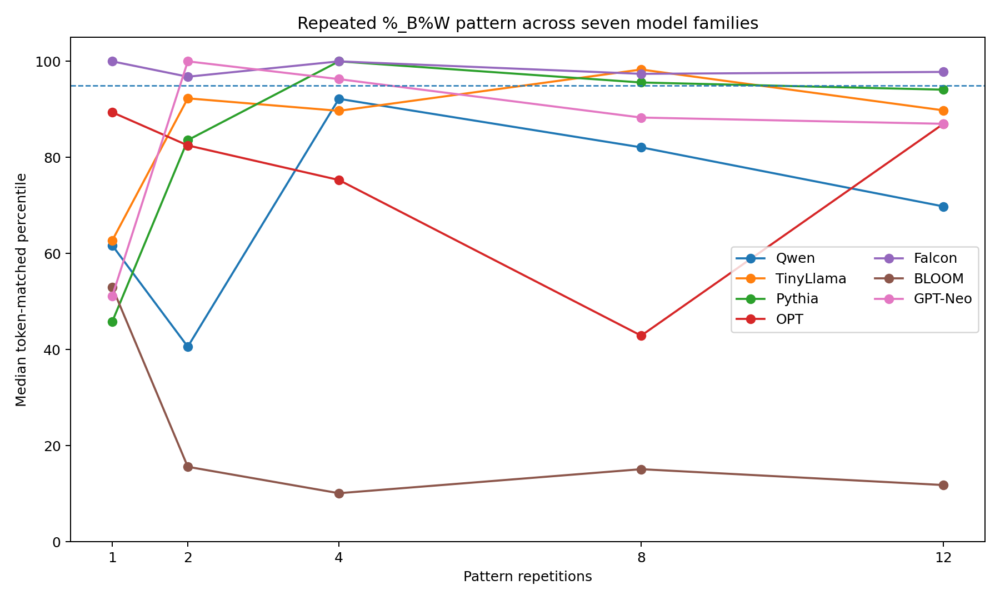

# Cross-Model Activation Anomaly Search

> **Work in progress.** An exploratory interpretability/evaluation project studying whether structured character strings can produce unusual hidden-state activations across language models with different architectures and tokenizers.

## Current research question

Can the same input structure produce unusually large internal activations across independently trained language models — and, if so, what property of the input causes the effect?

The project started as a search for individual cross-model anomalous strings. The current focus is **mechanism**: repetition, tokenization, architecture, numerical precision, and the anomaly metric itself.

No security vulnerability or universal LLM failure mode is claimed.

## Why this project exists

The goal is not to showcase a single strange prompt. It is to build a reproducible experimental pipeline and stress-test the interpretation at every stage:

```text
candidate generation
        ↓
per-model activation baselines
        ↓
cross-model scoring
        ↓
locked candidates
        ↓
held-out model evaluation
        ↓
matched controls
        ↓
mechanism / confound analysis
```

A major theme of the project is that several apparently exciting results became weaker or changed interpretation once stronger controls were added.

## Experiment 1 — 10,000-string cross-model search

10,000 candidate strings were generated **before model scoring** and evaluated on five model families:

- Qwen2.5-0.5B
- TinyLlama-1.1B
- Pythia-410M
- OPT-350M
- Falcon-RW-1B

Candidates were ranked by their **worst empirical percentile** across the five models.

The top search candidate was:

```text
%_B%W%_B%W%_B%W%_B%W%_B%W%_B%W%_B%W%_B%W%_B%W%_B%W%_B%W%_B%W
```

| Search model | Percentile |
|---|---:|
| Qwen2.5-0.5B | 98.16 |
| TinyLlama-1.1B | 96.66 |
| Pythia-410M | 97.01 |
| OPT-350M | 95.33 |
| Falcon-RW-1B | 98.86 |

The candidate was then locked before testing additional models.

### Important correction

An initial BLOOM holdout run appeared extremely strong, but later diagnostics showed that **BLOOM produced NaNs in the float16 measurement pipeline**. That earlier BLOOM result is therefore retained only as experiment history and should **not** be treated as reliable evidence.

This discovery motivated a stricter mechanism experiment and a BLOOM float32 retest.

## Experiment 2 — repetition vs. specific pattern

The next experiment tested whether the effect was caused by:

1. repetition in general,
2. the specific `%_B%W` pattern,
3. the same characters shuffled,
4. random repeated blocks,
5. or unusual/random ASCII.

The experiment used:

- 7 model families,
- 120 normal baseline texts per model,
- 160 experimental strings,
- 3,000 matched controls,
- token-count-matched percentile comparisons.

Models:

- Qwen
- TinyLlama
- Pythia
- OPT
- Falcon
- BLOOM
- GPT-Neo

No adaptive search or optimization was used in this experiment.

## Current result

The specific `%_B%W` repetition pattern is **not a universal cross-model anomaly**.

Its corrected token-matched median percentiles are:

| Repetitions | Qwen | TinyLlama | Pythia | OPT | Falcon | BLOOM* | GPT-Neo |
|---:|---:|---:|---:|---:|---:|---:|---:|
| 1 | 61.7 | 62.7 | 45.8 | 89.4 | 100.0 | 53.0 | 51.1 |
| 2 | 40.6 | 92.3 | 83.6 | 82.5 | 96.8 | 15.6 | 100.0 |
| 4 | 92.2 | 89.7 | 100.0 | 75.3 | 100.0 | 10.1 | 96.3 |
| 8 | 82.1 | 98.3 | 95.6 | 42.9 | 97.4 | 15.1 | 88.3 |
| 12 | 69.8 | 89.8 | 94.1 | 87.0 | 97.8 | 11.8 | 87.0 |

\* BLOOM values are from the corrected **float32** retest.



The pattern is consistently extreme in Falcon and often high in several other model families, while corrected BLOOM behaves very differently. Other repeated/control families also become high-percentile in some architectures.

The evidence therefore currently supports a more cautious interpretation:

> **Repeated structure interacts strongly with model/tokenizer architecture, but the mechanism is not yet established and the effect is not universal.**

## Active investigation: why is BLOOM different?

This is the current research focus.

BLOOM initially behaved pathologically in float16, producing non-finite values. A diagnostic rerun in float32 showed finite hidden states and a completely finite baseline.

The full BLOOM repetition experiment was then repeated in float32 with the same:

- 120-text baseline,
- 160 experiment strings,
- 3,000 matched controls,
- random seeds,
- token-count matching.

For `%_B%W`, the corrected BLOOM percentiles fell to roughly 10–16% for 2–12 repetitions.

I am currently investigating **why BLOOM differs from the other model families**, including whether the discrepancy is driven by:

- numerical precision,
- tokenizer behavior,
- architectural differences,
- layer/dimension behavior,
- or limitations of the current anomaly score.

This is ongoing work; the repository intentionally records the discrepancy instead of smoothing it away.

## Activation anomaly metric

For each model:

1. Run normal baseline texts and collect hidden states.
2. For every layer and hidden dimension, record the maximum absolute activation over non-padding token positions.
3. Estimate the baseline median and 95th percentile for each layer/dimension.
4. Use a robust scale:

```text
scale = max(q95 - median, 0.1 * median, 1e-3)
```

5. Candidate dimension score:

```text
(candidate_max - q95) / scale
```

6. The exploratory anomaly score is the maximum standardized score across non-embedding hidden states and hidden dimensions.

This is an **exploratory heuristic**, not a probability, z-score, or established interpretability benchmark.

## What changed during the research

The repo deliberately preserves failed and corrected approaches.

### Early RMS result
Raw RMS appeared to expose very large activations. Inspection showed that stable, model-specific dimensions could dominate the measurement.

### Per-dimension baseline
The metric was changed to compare each layer/dimension only against its own normal-text distribution.

### Flawed cross-model normalization
An early joint search normalized raw scores by a calibration quantile. This could make a model look strong even when its empirical percentile was ordinary.

It was replaced by actual empirical percentiles.

### Search-set overfitting
A string optimized on several models transferred poorly to Falcon, demonstrating why held-out model families matter.

### Fixed 10,000-string search
The search procedure was replaced by a pre-generated candidate pool scored identically across five model families.

### Repetition follow-up
Top candidates were dominated by repeated short patterns, so the project shifted from "find a magic string" to controlled tests of repetition and token structure.

### BLOOM numerical failure
A later control experiment exposed float16 NaNs in BLOOM. The model was rerun in float32, which changed the interpretation substantially.

## Repository layout

```text
.
├── README.md
├── STATUS.md
├── RESEARCH_NOTES.md
├── SECURITY.md
├── pyproject.toml
├── requirements.txt
├── notebooks/
│   ├── research_log.ipynb
│   └── research_log_clean.ipynb
├── src/cross_model_anomalies/
│   ├── candidates.py
│   ├── data.py
│   ├── modeling.py
│   └── scoring.py
├── scripts/
│   └── run_cross_model_search.py
├── experiments/
│   ├── repetition_vs_pattern.py
│   ├── bloom_float32_diagnostic.py
│   └── bloom_float32_retest.py
├── results/
│   ├── top20_search.csv
│   ├── initial_holdout_results_legacy.csv
│   ├── initial_cross_model_results_legacy.csv
│   ├── repetition_family_summary_corrected.csv
│   ├── repetition_target_percentiles_corrected.csv
│   ├── repetition_cross_model_corrected.csv
│   └── bloom_float32_retest.csv
└── assets/
    └── repetition_target_percentiles.png
```

## Reproducing the completed cross-model search

A CUDA GPU is strongly recommended.

```bash
git clone <your-repository-url>
cd cross-model-activation-anomalies

python -m venv .venv
source .venv/bin/activate

pip install -e .
python scripts/run_cross_model_search.py
```

For a smaller smoke test:

```bash
python scripts/run_cross_model_search.py \
  --n-baseline 40 \
  --n-candidates 500 \
  --n-holdout-controls 200 \
  --top-k 5
```

The later experimental scripts are preserved separately because they correspond to evolving research questions rather than one frozen benchmark.

## Notebook

`notebooks/research_log.ipynb` is the latest Colab research log with outputs preserved.

It includes the progression from initial RMS measurements through:

- baseline debugging,
- single-model search,
- failed transfer,
- corrected multi-model search,
- fixed candidate-pool search,
- repetition controls,
- BLOOM NaN diagnosis,
- and the float32 BLOOM retest.

`research_log_clean.ipynb` contains the same code with cell outputs removed for easier inspection.

## Limitations

- The anomaly score is exploratory and based on a global maximum.
- The candidate generator defines the population used for search percentiles.
- Several experiments use relatively small baseline samples.
- Models are relatively small open-weight LMs.
- Token-count matching reduces one confound but does not establish causality.
- The original BLOOM float16 holdout result is invalid as confirmatory evidence.
- The mechanism behind the architecture-dependent repetition effect is unresolved.
- Repeated runs, stronger statistical tests, and additional held-out architectures are still needed.

## Status

**Research in progress.**

The current goal is not to claim a discovery prematurely. The next milestone is to explain the BLOOM discrepancy and determine which properties of repetition/tokenization predict activation anomalies across architectures.


## Security

The maintained code and public notebooks use `trust_remote_code=False`.
No API keys or private credentials are required. See [`SECURITY.md`](SECURITY.md)
for the public-release security notes and safe-running guidance.
